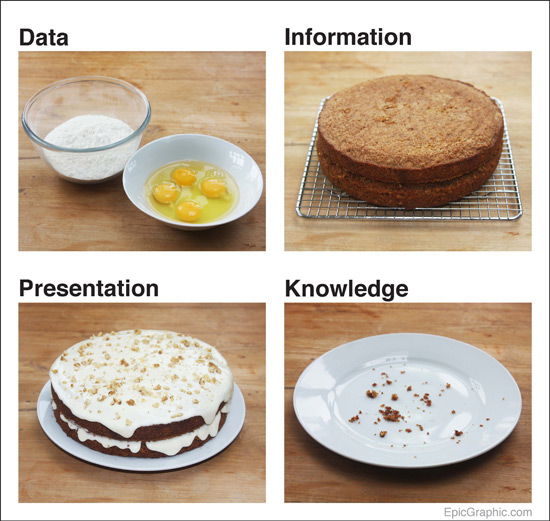

<!-- $theme: default-->
<!-- page_number: true -->
<!-- $size: 16:9 -->

# Les données primaires dans la recherche : introduction et enjeux

Journée d'étude 

**Du montage de projet de recherche à la publication : enjeux et pratiques autour des données primaires**

9 novembre 2017

*Frédérique Flamerie* 

*chargée de mission science ouverte/données de la recherche*

*Université de Bordeaux - Direction de la Documentation*

---
# Au programme
## Définir, caractériser, cerner
## Enjeux et impacts
## Perspectives

---
# Définir ?
>Providing an authoritative definition of research data is challenging, as any definition is likely to depend on the **context** in which the question is asked.

<small>
Australian National Data Service. (2017, 11 janvier). What is research data? Repéré à www.ands.org.au/guides/what-is-research-data
</small>

---
# Définition 1
## UCL - University College of London
> Data are facts, observations or experiences on which an argument or theory is constructed or tested. Data may be numerical, descriptive, aural or visual. Data may be raw, abstracted or analysed, experimental or observational. Data include but are not limited to: laboratory notebooks; field notebooks; primary research data (including research data in hardcopy or in computer readable form); questionnaires; audiotapes; videotapes; models; photographs; films; test responses. 
>
 
<small>
LEARN Project. (2016). _LEARN Project RDM Glossary_. Repéré à http://learn-rdm.eu/wp-content/uploads/LEARN-Toolkit-Glossary-published-v1.pdf
</small>

---
# Typologies
- [DataCite](https://search.datacite.org/works?query=*)

Jeu de données, texte, image, collection, autre, logiciel, audiovisuel, objet physique, événement, film, son, modèle, ressource interactive, processus, service

- [Re3data](http://www.re3data.org/browse/by-content-type/)

Données archivées, données audiovisuelles, données de configuration, bases de données, images, données de réseau, texte simple, données brutes, données scientifiques et statistiques, logiciels, code source, documents administratifs, graphiques structurés, texte structuré, autre

---
# Définition 2
Politique PLoS définie en 2 temps et commentée dans 
<small>
Hodson, S. &amp; Molloy, L. (2015). _Current Best Practice for Research Data Management Policies_. Danish e-Infrastructure Cooperation and the Danish Digital Library. https://doi.org/10.5281/zenodo.27872
</small>

## Temps 1
<small>

>**_What do we mean by data?_**
>“Data are any and all of the digital materials that are collected and analyzed in the pursuit of scientific advances.” Examples could include spreadsheets of original measurements (of cells, of fluorescent intensity, of respiratory volume), large datasets such as next-generation sequence reads, verbatim responses from qualitative studies, software code, or even image files used to create figures. Data should be in the form in which it was originally collected, before summarizing, analyzing or reporting.

</small>

---
# Définition 2
Politique PLoS définie en 2 temps et commentée dans 
<small>
Hodson, S. &amp; Molloy, L. (2015). _Current Best Practice for Research Data Management Policies_. Danish e-Infrastructure Cooperation and the Danish Digital Library. https://doi.org/10.5281/zenodo.27872
</small>

## Temps 2
<small>

>**_Correction_**
> We have struck out the paragraph in the original PLOS ONE blog post headed “_What do we mean by data?_”, as we think it led to much of the confusion. Instead we offer this guidance to authors planning to submit to a PLOS journal.
>  
> **_What data do I need to make available?_**
> We ask you to make available **the data underlying** the findings in the paper, which would be needed by someone wishing to **understand, validate or replicate** the work. Our policy has not changed in this regard. What has changed is that we now ask you to say where the data can be found.
</small>
---

# Rôle clé  : valider les résultats de recherche

<small>

> Research data refers to all information (independent of form or presentation) needed to **support or validate** the development, results, observations or findings of a research project, including contextual information. Research data include all materials which are created in the course of academic work, including digitisation, records, source research, experiments, measurements, surveys and interviews. This includes software and code. Research data can take on several forms: during the lifespan of a research project, data can exist as gradations of **raw** data, **processed** data (including negative and inconclusive results), **shared** data, **published** data and **Open Access published** data, and **with varying levels of access**, including open data, restricted data and closed data.
</small>

<small>
LEARN Project. (2017). _LEARN Toolkit of Best Practice for Research Data Management_. Repéré à http://learn-rdm.eu/wp-content/uploads/RDMToolkit.pdf
</small>

---
# Rôle clé  : valider les résultats de recherche
>Les données de recherche sont des éléments concrets collectés, étudiés ou générés dont la communauté scientifique admet communément la nécessité pour **documenter** et **valider** les résultats de recherche.

<small>
Fonds national suisse de la recherche scientifique. (2017). Open Research Data. _Fonds national suisse de la recherche scientifique_. Repéré à https://huit.re/FNS_open_data
</small>

---
# Caractériser
### Valid-
### Partag-
### Hétérogènes
### Contextualisées

---
# Approche pyramidale
<!-- *footer: Source image : Ayris, P. (2013). LERU Roadmap for Research Data (Rapport No. 14). LERU. Repéré à http://www.leru.org/files/publications/AP14_LERU_Roadmap_for_Research_data_final.pdf -->

---
# Approche pyramidale - sous-titre
> The main purpose of this pyramid is to explain the different **manifestations** research data can have **in the context of their availability** within, with, supplementary to or referenced from an official scholarly article as the main manifestation of the record of science.

<small>
Ayris, P. (2013). _LERU Roadmap for Research Data_ (Rapport No. 14). LERU. Repéré à http://www.leru.org/files/publications/AP14_LERU_Roadmap_for_Research_data_final.pdf
</small>

---
# Approche culinaire

<!-- *footer: Source image : Johnstone, M. (2016). data cake. Repéré à http://www.markjohnstone.co/data-cake/ -->
 
---
# Approche culinaire - terminologie

 | Data relationships | Definition|
 :---- | :---- 
**Data** | Numbers, characters or images that designate an attribute of a phenomenon.
 **Information** |  Data become information when they are combined together in ways that have the potential to reveal patterns in the phenomenon.
 **Knowledge**  |  Information yields knowledge when it supports non-trivial, true claims about a phenomenon.
<small>
Boulton, G. &amp; Working group. (2012). _Science as an open enterprise_ (Rapport No. 02/12). The Royal Society Science Policy Centre. Repéré à https://royalsociety.org/~/media/policy/projects/sape/2012-06-20-saoe.pdf

</small>

---
# Approche dynamique

<!-- *footer: Source image : Morgan, H. (2017). Research Data Management. Repéré à http://libguides.library.cqu.edu.au/researchdatamanagement -->

---

# Enjeux et impacts - de la grande à la petite image
## La grande image
## De la grande à la petite image
## La petite image  : gérer, publier et citer des données

---
# La grande image : un enjeu global : acteurs et processus
> Research data as an integral part of the scholarly record is increasingly attracting attention of all stakeholder groups. **Higher education institutions, funding agencies, policy makers** as well as the public at large see benefits in **accelerating science** through **opening access to research data**. More specifically, this aims at **better re-usability and verification of research findings**. The latter is particularly of great interest for higher education and other research institutions, as they embody scholarly scrutiny and trust.

<small>
Simukovic, E., Kindling, M., &amp; Schirmbacher, P. (2014). Unveiling Research Data Stocks: A Case of Humboldt-Universität zu Berlin. https://doi.org/10.9776/14351
</small>

---
# La grande image : la prescription européenne
<small>

>The Commission considers that **there should be no need to pay for information funded from the public purse** each time it is accessed or used. Moreover, it should benefit European **businesses** and the **public** to the full. This means making publicly-funded scientific inform ation available online, at no extra cost, to European researchers, innovative industries and the public, while ensuring that it is **preserved in the long term**.
>
>...
>
>The Commission's approach can therefore be described as "**as open as possible, as closed as necessary**".
[...] the focus of the Pilot is on encouraging **good data management** as an essential element of **research best practice**.
</small>

<small>
European Commission - Directorate-General for Research &amp; Innovation. (2017). _Guidelines on FAIR Data Management in Horizon 2020_ (Rapport No. Version 3.0). European Commission. Repéré à http://ec.europa.eu/research/participants/data/ref/h2020/grants_manual/hi/oa_pilot/h2020-hi-oa-data-mgt_en.pdf
</small>

---
# La grande image : FAIR
>    Distinct from peer initiatives that focus on the human scholar, the FAIR Principles put specific emphasis on enhancing the ability of **machines** to automatically find and use the data, in addition to supporting its reuse by individuals.
>
>...
>
> All scholarly digital research objects - from data to analytical pipelines - benefit from application of these principles, since all components of the research process must be available to ensure **transparency**, **reproducibility**, and **reusability**.

<small>
Wilkinson, M. D. _et al._ (2016). The FAIR Guiding Principles for scientific data management and stewardship. _Scientific Data_, _3_, sdata201618\. https://doi.org/10.1038/sdata.2016.18
</small>

---
# La grande image : FAIR
<!-- *footer: Source image : SangyaPundir. (2016). FAIR guiding principles for data resources. Repéré à https://commons.wikimedia.org/wiki/File:FAIR_data_principles.jpg?uselang=fr -->

<small>
Hagstrom, S. (2014, 3 septembre). The FAIR Data Principles. _FORCE11_. Repéré à https://www.force11.org/group/fairgroup/fairprinciples
</small>

---

# La grande image : FAIR
Items détaillés et commentés sur le site du FNS. Pour chaque item :
- le principe,
- une reformulation en d'autres termes,
- la responsabilité du chercheur,
- la caractéristique de l'entrepôt de données.

<small>
Fonds national suisse de la recherche scientifique. (2017). Explanation of the FAIR data principles. Repéré à http://www.snf.ch/SiteCollectionDocuments/FAIR_principles_translation_SNSF_logo.pdf

</small>

---
# De la grande à la petite image : anecdotes
>I was reduced to blowing up figures on the copier and drawing pencil lines across the image. [...] Alas, too much time had gone by since the paper was published in 2001 and our colleague was now suffering from badly failing eye sight, the student who executed the work and provided the data equation had moved on and contact had been lost.

<small>
Brewer, P. (2017, 14 septembre). “Do You Expect Me to Just Give Away My Data?” _Editors’ Vox_. Repéré à https://eos.org/editors-vox/do-you-expect-me-to-just-give-away-my-data

</small>

Et plus encore... <small>
Teperek, M. (2017, 20 septembre). Data Management: Why would I bother?... Delft. https://doi.org/10.5281/zenodo.897785

</small>

---
# De la grande à la petite image : gestion des données
<!-- *footer: Source images : Teperek, M. (2017, 20 septembre). Data Management: Why would I bother?... Delft. https://doi.org/10.5281/zenodo.897785. Et : https://doi.org/10.5281/zenodo.58524-->
 

---
# De la grande à la petite image : publication des données
<!-- *footer: Source images : https://doi.org/10.1002/marc.201700287 et https://doi.org/10.1038/sdata.2016.108 -->
 

---
# De la petite à la grande image : les obstacles
<!-- *footer: Source image : Kingsley, D. (2017, 21 septembre). Is the tail wagging the dog? Perversity in academic rewards [Keynote Address]. Keynote Address communication présentée au 9th Conference on Open Access Scholarly Publishing, Lisbon. Repéré à https://www.repository.cam.ac.uk/handle/1810/267263 -->

---
# De la petite à la grande image : les obstacles
>_As a researcher concerned to develop better RDM practice, I need support to meet me where I am, so ultimately I can support you in making the case that it matters._

Neylon, C. (2017, 16 juin). As a researcher…I’m a bit bloody fed up with Data Management. _Science in the Open_. Repéré à http://cameronneylon.net/blog/as-a-researcher-im-a-bit-bloody-fed-up-with-data-management/

---
# La petite image 
# Camembert 1
<!-- *footer: Image modifiée de : Morgan, H. (2017). Research Data Management. Repéré à http://libguides.library.cqu.edu.au/researchdatamanagement -->

---
# La petite image : camembert 1 : gérer des données
Le *Data Management Plan* - *DMP* - plan de gestion des données : un outil dynamique pour planifier le cycle de vie des données, se poser et répondre à des questions telles que :
- quelles donnnées vont-elles être collectées, observées ou générées?
- selon quelles méthodologies et standards?
- quelles données vont-elles être **partagées** et comment?
- quelles données vont-elles être **préservées** et comment?

<small>
Whyte, A. (2014). _Five steps to decide what data to keep_. Edinburgh : Digital Curation Centre. Repéré à http://www.dcc.ac.uk/resources/how-guides/five-steps-decide-what-data-keep
</small>

### Un exemple de *DMP* 
<small>
Gatto, L. (2017). Data Management Plan for a Biotechnology and Biological Sciences Research Council (BBSRC) Tools and Resources Development Fund (TRDF) Grant. _Research Ideas and Outcomes_, _3_, e11624. https://doi.org/10.3897/rio.3.e11624
</small>

---
# La petite image
# Camembert 2
<!-- *footer: Image modifiée de : Morgan, H. (2017). Research Data Management. Repéré à http://libguides.library.cqu.edu.au/researchdatamanagement -->

---
# La petite image : camembert 2 : gérer des données
## Organiser et documenter
>At the lowest level, working reproducibly just means **avoiding beginners’ mistakes**. Keep your project organized, name your files and directories in some informative way, store your data and code at a single backed-up location.

<small>
Markowetz, F. (2015). Five selfish reasons to work reproducibly. _Genome Biology_, _16_, 274. https://doi.org/10.1186/s13059-015-0850-7
<small>

Et aussi : 

Teperek, M. (2017, 20 septembre). Data Management: Why would I bother?... Delft. https://doi.org/10.5281/zenodo.897785

---
# La petite image : camembert 2 : gérer des données
## Traiter
- Formats de données : standards disciplinaires, formats ouverts/propriétaires, contraintes liées aux applications utilisées/utilisables
- De la mise en cohérence de données tabulaires à des problématiques plus complexes (anonymisation de données personnelles)

## Stocker?
| Phase | Practice | Definition|
| :---- | :----: | :---- |
| <mark>During</mark> research | Data <mark>storage</mark> | The storage of data while the research is being conducted, *i.e.* while data are being produced or collected (for reuse), analysed and/or processed, and prepared for publication.|
| <mark>After</mark> research |  Data <mark>archiving</mark>|The long-term saving of data after the research has been completed, *i.e.* the archiving of data in a durable and searchable environment, possibly with access rights.|

<small>
Zeeland, H. van &amp; Ringersma, J. (2017). The development of a research data policy at Wageningen University &amp; Research: best practices as a framework. _LIBER Quarterly_, _27_(1), 153‑170\. https://doi.org/10.18352/lq.10215
</small>

---
# La petite image
# Camembert 3
<!-- *footer: Image modifiée de : Morgan, H. (2017). Research Data Management. Repéré à http://libguides.library.cqu.edu.au/researchdatamanagement -->

---
# La petite image : camembert 3 : gérer et publier des données
Comme le *DMP*, l'entrepôt de données est un outil de questionnementet et cristallise différents enjeux.
Comment choisir un entrepôt de données? Quels critères de choix appliquer?
- Compatibilité "FAIR"
- Caractère commercial/non-commercial - Ex Dryad/Figshare ; critère retenu par le FNS

<small>
Fonds national suisse de la recherche scientifique. (2017, 17 avril). Examples of data repositories. Repéré à http://www.snf.ch/SiteCollectionDocuments/FAIR_data_repositories_examples.pdf

</small>

- Recommandation/certification

<small>
Husen, S. E., Wilde, Z. G. de, Waard, A. de, &amp; Cousijn, H. (2017). Recommended versus Certified Repositories: Mind the Gap. _Data Science Journal_, _16_(0). https://doi.org/10.5334/dsj-2017-042
</small>

## Démarche détaillée 
<small> 
Whyte, A. (2015). _Where to keep research data_ (Rapport No. v. 1.1). Edinburgh : Digital Curation Centre. Repéré à http://www.dcc.ac.uk/resources/how-guides-checklists/where-keep-research-data/where-keep-research-data#3
</small>

---
# La petite image : camembert 3 : citer des données
## Retour à la grande image : impact des données
> Specifically, data-related impact researchers can have includes
>- reuse of data they have shared to derive new knowledge;
>- incorporation of their data into larger datasets or data products;
>- widespread use of software or workflows they have written.

<small>
Ball, A. &amp; Duke, M. (2015). _How to Track the Impact of Research Data with Metrics_. Edinburgh : Digital Curation Centre. Repéré à http://www.dcc.ac.uk/resources/how-guides/track-data-impact-metrics
</small>

## La citation comme indicateur *proxy* d'impact des données
- Citer directement les jeux de données
- Approche transitionnelle : citer des *data paper*
- Index de citation :  _Data Citation Index_ (Clarivate Analyics)

---
# La petite image : camembert 3 : citer des données
Des contraintes concrètes viennent compliquer la citation des  données ; le type "jeu de donnée" n'est ainsi pas prévu par tous les styles bibliographiques, ni géré en tant que tel par tous les outils de gestion bibliographique.
## Styles bibliographiques
[APA](http://blog.apastyle.org/apastyle/2013/12/how-to-cite-a-data-set-in-apa-style.html) indique d'ajouter la mention **[Data set]**
## Logiciels et formats de gestion bibliographique (ouverts)
### Zotero : solution indirecte pour l'instant
>Field and item type updates are planned for version 5.1. Dataset will definitely be included. If you want to, you can use an item type like journal article (because it has DOIs) and "force" it into being a dataset for citation purposes by including "**itemType: dataset**" (without the quotation marks) in the "**Extra**" field. This will migrate automatically to a proper item type once that's introduced. Note that very few citation styles have specified formats for datasets.

Source : [Forum Zotero](https://forums.zotero.org/discussion/comment/266721/#Comment_266721)

### BibTex 
Pas de type spécifique ; utilisation par défaut de **@misc**

---
# La petite image : camembert 3 : créditer
## Quel statut pour les auteurs de données dans un article réutilisant les données qu'ils ont produites? 
Discussion à partir d'un exemple récent en médecine : 
Scientific Data. (2017). Refining our policies on co-authorship requirements. _Scientific Data_, _4_, sdata2017133\. https://doi.org/10.1038/sdata.2017.133

---
# Perspectives - de la grande à la petite image
## La grande image : les politiques
## De la grande à la petite image : lever les barrières?
## La petite image : optimisme

---
# La grande image : les politiques
## Le G7
> **art. 19** [...] We agree that an international approach can help the speed and coherence of this transition, and that it should target in particular two aspects. First, **the incentives for the openness of the research ecosystem**: the evaluation of research careers should better recognize and reward Open Science activities. Secondly, **the infrastructures for an optimal use of research data**: all researchers should be able to deposit, access and analyse scientific data across disciplines and at the global scale, and research data should adhere to the FAIR principles of being findable, accessible, interoperable, and reusable. 

G7. (2017, 28 septembre). G7 Science Ministers’ Communiqué Turin, 27-28 September. Repéré à https://huit.re/gt_open_science

---
# La grande image : les politiques
## Le financeur
### Europe : Horizon 2020 Open Research Data
European Commission - Directorate-General for Research &amp; Innovation. (2017). _Guidelines on FAIR Data Management in Horizon 2020_ (Rapport No. Version 3.0). European Commission. Repéré à http://ec.europa.eu/research/participants/data/ref/h2020/grants_manual/hi/oa_pilot/h2020-hi-oa-data-mgt_en.pdf

### Suisse : FNS - Fonds national suisse de la recherche scientifique
Fonds national suisse de la recherche scientifique. (2017). Open Research Data. _Fonds national suisse de la recherche scientifique_. Repéré à https://huit.re/FNS_open_data

### Royaume-Uni : Wellcome Trust
Wellcome Trust. (2017, 10 juillet). Policy on data, software and materials management and sharing. _Wellcome Trust_. Repéré à https://wellcome.ac.uk/funding/managing-grant/policy-data-software-materials-management-and-sharing

---
# La grande image : les politiques
## L'établissement
### UCL - University College of London
> Unless covered by third party contractual agreements, legislative obligations or provisions regarding ownership, UCL research data will be provided using a Creative Commons CC0 waiver; supported by data citation guidelines similar to existing publishing conventions. This will ensure that re-used data are unambiguously identifiable and that appropriate credit and attribution is made.
> 
<small>
Ayris, P. (2013). _LERU Roadmap for Research Data_ (Rapport No. 14). LERU. Repéré à http://www.leru.org/files/publications/AP14_LERU_Roadmap_for_Research_data_final.pdf
</small>

### INRA
Charte : encouragement et offre de services
<small>
INRA. (2016, septembre). Charte pour le libre accès aux publications et aux données. INRA. Repéré à https://www6.inra.fr/datapartage/Documents-de-reference/Charte-Open-Access-de-l-INRA2

---
# La grande image : les politiques
## L'éditeur
> The majority of Wiley’s journals will now adopt one of three standardized data sharing policies, which will **encourage**, **expect**, or **mandate data sharing** from authors publishing with us. You will be able to review the data sharing policy on your selected journal’s author guidelines or via the Wiley Author Compliance Tool. Research data includes but is not limited to: **raw data, processed data, software, algorithms, protocols, methods, and materials**.
>
>...
>
> Further, Wiley has endorsed the FORCE11 Data Citation Principles and is implementing a **mandatory data citation policy**. Wiley journals will require that authors refer to the data at the relevant place in their manuscript and provide a formal citation in their reference list in the same way as article, book, and web citations.
> 
<small>
STM Publishing News. (2017, 14 septembre). Wiley announces new Data Sharing and Citation policies to improve transparency in research. _STM Publishing News_. Repéré à http://www.stm-publishing.com/wiley-announces-new-data-sharing-and-citation-policies-to-improve-transparency-in-research/
</small>

---
# De la grande à la petite image : lever les barrières?
## Grands principes 2014
>**3. Develop policies and initiatives that offer researchers rewards for open access to high quality data**
>
>Funder and institutional policies that offer researchers rewards for providing open access to high quality data are central in the transition towards open science. Official measures and processes need to be put in place to include the open sharing of research data in funding and professional advancement decisions.

<small>
RECODE Project Consortium. (2014). _Policy recommendations for open access to research data_. Repéré à http://recodeproject.eu/wp-content/uploads/2015/01/recode_guideline_en_web_version_full_FINAL.pdf

---
# De la grande à la petite image : lever les barrières?
## Grands principes 2017
<small>
Working Group on Rewards under Open Science. (2017). _Evaluation of Research Careers fully acknowledging Open Science practices. Rewards, incentives and/or recognition for researchers practicing Open Science_. European Commission Directorate - General for Research and Innovation. Repéré à http://ec.europa.eu/research/openscience/pdf/os_rewards_wgreport_final.pdf
</small>

---
# De la grande à la petite image : lever les barrières?
>  Replication work isn’t flashy.
>
>...
>
>I was only able to find one foundation in the United States that funds replication work. The Laura and John Arnold Foundation has underwritten influential replication initiatives in social science and cancer biology.
>
>...
>
>In 2016, the Netherlands Organization for Scientific Research announced that it would give away 3 million euros (about $3.6 million) to scientists seeking to replicate foundational research. In July the agency, which goes by its Dutch acronym, NWO, announced that it was funding nine projects.

Schulson, M. (2017, 11 septembre). Creating Incentives to Address the Replication Crisis in Science. _Undark_. Repéré à https://undark.org/article/replication-crisis-funding/

---
# La petite image : optimisme
## Recrutement et promotion : Indiana University-Purdue University Indianapolis (IUPUI)
> While the inclusion of the OA values was made quickly and without substantial opposition, it reflected **existing OA services, policies, and strategic plans** at IUPUI. It was also the outcome of **having the right people at the right place at the right time**.

<small>
Odell, J., Coates, H., &amp; Palmer, K. (2016). Rewarding open access scholarship in promotion and tenure: Driving institutional change. _College &amp; Research Libraries News_, _77_(7), 322‑325.
</small>

## Recrutement : Ludwig-Maximilians-Universität München - dpt de psychologie
Profil de poste publié en 2017, inclut :
> Our department embraces the values of open science and strives for replicable and reproducible research. For this goal we support transparent research with open data, open material, and pre-registrations. **Candidates are asked to describe in what way they already pursued and plan to pursue these goals**.

<small>
Schönbrodt, F. (2016, 6 janvier). Changing hiring practices towards research transparency: The first open science statement in a professorship advertisement. _Nicebread_. Repéré à http://www.nicebread.de/open-science-hiring-practices/

---
# La petite image : optimisme
## Géosciences
*Coalition on Publishing Data in the Earth and Space Sciences* : financement de la fondation Arnold en août 2017.

COPDESS. (2017). Enabling FAIR Data Project. _COPDESS - Coalition on Publishing Data in the Earth and Space Sciences_. Repéré à http://www.copdess.org/

## Biomédecine
*The Tanenbaum Open Science Institute*

Hayward, S. (2016, 16 décembre). McGill University announces a transformative $20 million donation to the Montreal Neurological Institute and Hospital. _Newsroom - McGill University_. Repéré à https://www.mcgill.ca/newsroom/channels/news/mcgill-university-announces-transformative-20-million-donation-montreal-neurological-institute-and-264838

---
# La petite image : optimisme
## Archéologie
> We introduce the Society of American Archaeology’s Open Science Interest Group (OSIG) as **a community to help archaeologists engage in and benefit from open science practices**, and describe how it will facilitate the adoption of open science in archaeology.

*"data-ownership mindset" vs "data stewardship"*
> Data stewardship advocates that researchers collect and share data on behalf of the scientific community and society, rather than for their individual career ambitions.
> 
Marwick, B. (2017). Open Science in Archaeology. _Open Science Framework_. https://doi.org/10.17605/OSF.IO/3D6XX

---
# La petite image : optimisme
## Ressources
[Datacarpentry](http://www.datacarpentry.org/)

Parcours en :
- écologie
- génomique
- données géospatiales

---
# Merci de votre attention
 

## frederique.flamerie-de-lachapelle@u-bordeaux.fr
 

[orcid.org/0000-0001-6014-0134](https://orcid.org/0000-0001-6014-0134)

 

**_Note technique : présentation composée en Markdown avec le logiciel Marp_**

